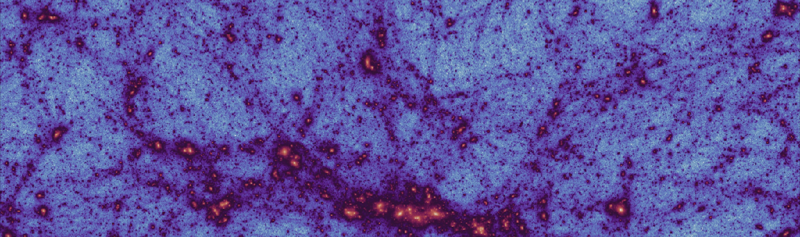

---
Hi there 👋🏽

I’m a computational astrophysicist at the University of Seville, Spain. I study galaxy formation and evolution, with a focus on the first stars and first galaxies in the Universe.

For this, I use analytical models, semi-analytical techniques, and large-scale cosmological simulations.
I’m always open to collaborations. Feel free to get in touch if you’d like to work together or if you have questions about any of my codes.

---
 

